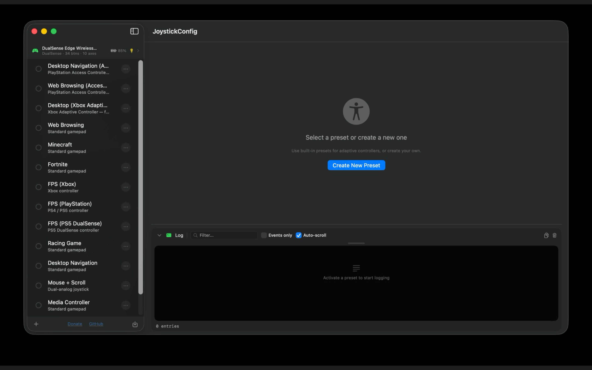
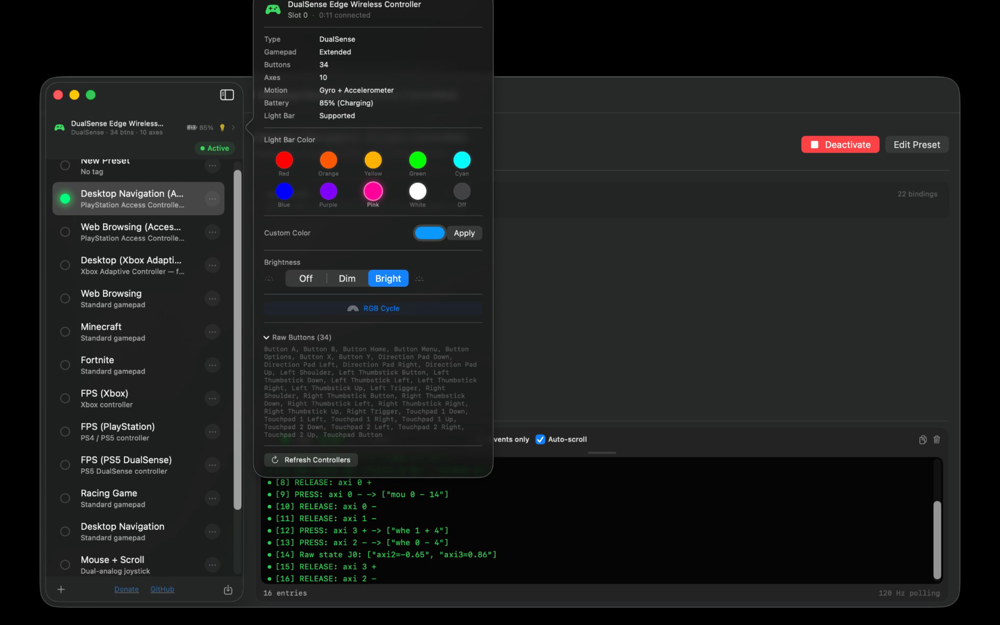
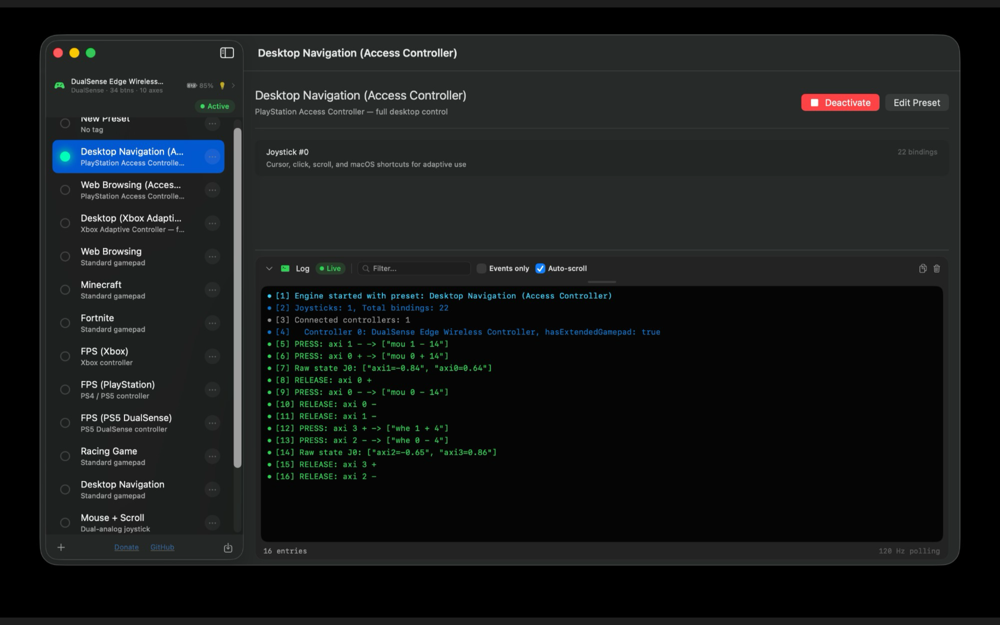
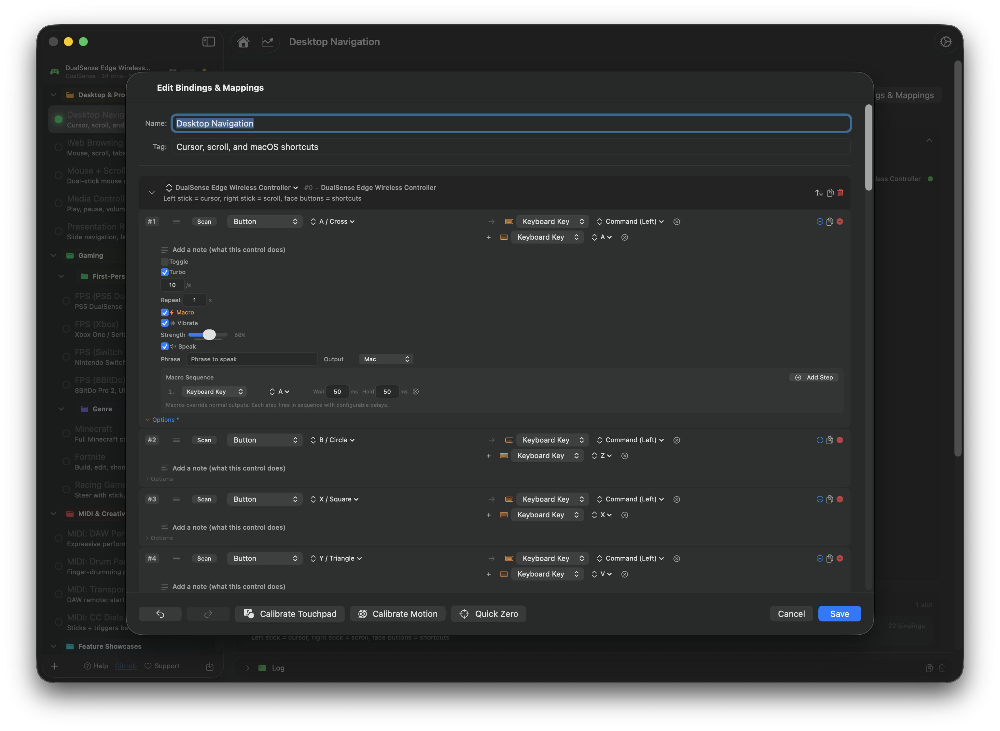

# InputConfig

Map any game controller to keyboard and mouse on macOS.

## Overview

InputConfig lets you use any game controller as a keyboard and mouse on your Mac. Plug in your controller, pick a preset, and go. Or build your own from scratch.

Works with DualSense (PS5), DualSense Edge, DualShock 4 (PS4), Xbox Wireless, and any MFi or HID-compatible gamepad. No drivers needed.

The main view shows all your presets on the left with a live status bar for connected controllers. You can see battery level, button count, axis count, and light bar status at a glance. Activate any preset with one click. The bottom panel is a live logger that shows engine activity, connected controllers, and input events in real time at 120Hz.

Click any connected controller in the status bar to open the controller panel. From here you can change the light bar color with presets or a custom color picker, adjust brightness, or kick off an RGB cycle. The panel also shows controller type, button and axis counts, motion support, battery level, and the full list of raw button names exposed by the device.

When you activate a preset, the engine starts polling at 120Hz and the live log on the right shows everything happening in real time. You can see which bindings are firing, the exact serialized output for each press, raw axis values, and timing information for every event. Useful for diagnosing why a binding is not firing or for confirming a macro is firing in the right order.

The binding editor is where you set up your mappings. Hit Scan to detect a button press or axis movement from your controller, then assign it to a keyboard key, mouse button, mouse motion, or scroll wheel. Every binding has its own output type picker and value selector. You can add multiple outputs per input, reorder bindings with drag and drop, and duplicate or delete them individually. Each binding has advanced options to set per-axis deadzones, invert axes, pick a sensitivity curve, enable toggle mode, configure turbo rapid fire, set repeat count and delay, or build a macro sequence with custom wait and hold times per step.

## Features

- Map buttons, triggers, joysticks, and D-pad to keyboard keys, mouse movement, mouse buttons, and scroll wheel
- Built-in presets for adaptive controllers, desktop navigation, web browsing, media control, and popular games
- Live controller visualizer mirrors your input in real time
- Record macro sequences with custom timing per step
- Turbo (rapid fire) and toggle mode on any button
- Adjustable deadzones, axis inversion, and sensitivity curves with visual calibration
- Customize controller light bar colors per preset with a full RGB color picker
- Send MIDI output to your favorite DAW
- Built-in 3D gyroscope and motion tracking
- Touchpad surface calibration
- Create unlimited presets and switch instantly
- Import, export, and share presets between users
- Convert presets between controller types
- Works with any HID-compatible gamepad, no drivers needed
- Lifetime usage statistics

100% free.

## Supported Controllers

- PlayStation DualSense (PS5) and DualSense Edge
- PlayStation DualShock 4 (PS4)
- Xbox Wireless Controller
- Any MFi or HID-compatible gamepad

## Requirements

- macOS 14.0 or later
- Accessibility permission (for keyboard and mouse simulation)

## Building

1. Open `InputConfig.xcodeproj` in Xcode 16+
2. Select your team in Signing & Capabilities
3. Build and run

## License

MIT License. See [LICENSE](LICENSE) for details.

## Privacy

InputConfig does not collect any data. See [PRIVACY.md](PRIVACY.md).

## Contact

Questions, bugs, or feature requests? Reach out at [ryleighnewman.com](https://ryleighnewman.com).
