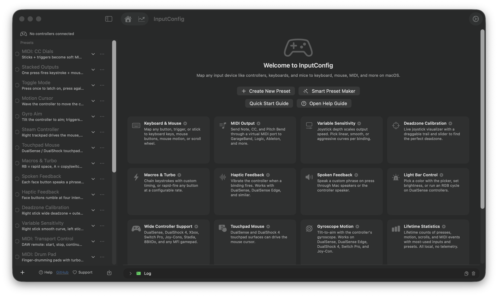
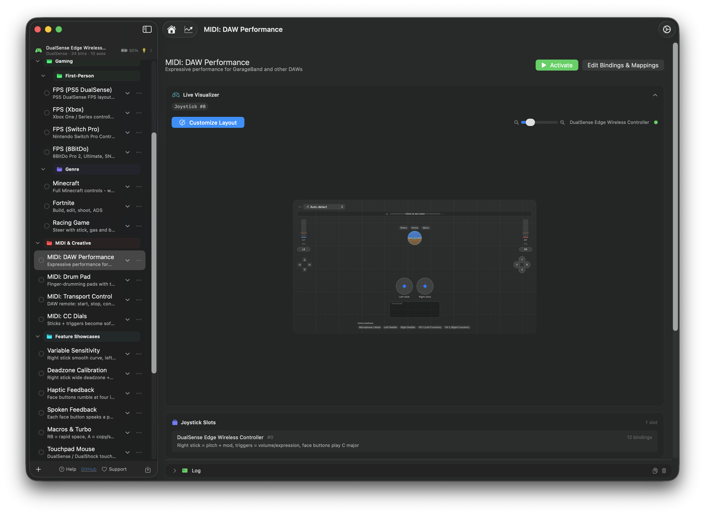

# InputConfig

Map any game controller to keyboard and mouse on macOS.

> InputConfig was previously called JoystickConfig. It is being re-released on the Mac App Store under the new name, so the download link is temporarily unavailable. It will be back as soon as the new version is approved.

## Overview

InputConfig lets you use any game controller as a keyboard and mouse on your Mac. Plug in your controller, pick a preset, and go. Or build your own from scratch.

Works with DualSense (PS5), DualSense Edge, DualShock 4 (PS4), Xbox Wireless, Nintendo Switch Pro, 8BitDo, and any MFi or HID-compatible gamepad. No drivers needed.

You can map to more than keys and clicks. Type whole phrases, send MIDI to a DAW, or control InputConfig itself from a button. And it is not just for game controllers: your Mac keyboard, mouse, and trackpad can be inputs too, including Force Touch trackpad pressure.

When you open InputConfig it shows you everything it can do up front. Start a preset from scratch, let the Smart Preset Maker build one for you, or open a guide. The cards below are the features you can build with: keyboard and mouse output, MIDI, variable sensitivity, deadzone calibration, macros and turbo, haptic and spoken feedback, light bar control, full controller support, touchpad mouse, gyroscope motion, and lifetime statistics.

Activate a preset and the live visualizer mirrors your controller on screen in real time. Every button, stick, and trigger lights up as you press it, so you can confirm a mapping is working at a glance. The preset list on the left is organized into folders you can name and color, and the log along the bottom shows every event as it fires at 120Hz. The status bar up top shows each connected controller with its battery, button and axis counts, and light bar. Click a controller to change its light bar color, adjust brightness, or start an RGB cycle.

The binding editor is where you set up your mappings. Hit Scan to detect a button press or axis movement from your controller, then assign it to a keyboard key, mouse button, mouse motion, or scroll wheel. Every binding has its own output type picker and value selector. You can add multiple outputs per input, reorder bindings with drag and drop, and duplicate or delete them individually. Each binding has advanced options for per-axis deadzones, axis inversion, sensitivity curves, toggle mode, turbo rapid fire, repeat count and delay, or a full macro sequence with custom wait and hold times per step.

## Features

- Map buttons, triggers, joysticks, and D-pad to keyboard keys, mouse movement, mouse buttons, and scroll wheel
- Type whole words or phrases from a single button
- Trigger app actions from your controller: switch presets, jump to a specific preset, or pause and resume output
- Tap and hold for two actions on one button, a quick tap does one thing and holding does another
- Double tap a button for a third action
- Use your Mac keyboard, mouse, and trackpad as inputs too, including Force Touch trackpad pressure and Force Click
- Switch presets automatically based on the app you are using
- Hundreds of built-in presets for adaptive controllers, desktop navigation, web browsing, media control, popular games, and Mac apps
- Live controller visualizer mirrors your input in real time
- Record macro sequences with custom timing, including chord steps that hold one key while tapping others
- Turbo (rapid fire) and toggle mode on any button
- Map cursor zones, stick zones, and touchpad regions and gestures
- Adjustable deadzones, axis inversion, and sensitivity curves with visual calibration
- Customize controller light bar colors per preset with a full RGB color picker
- Send MIDI output to your favorite DAW
- Built-in 3D gyroscope and motion tracking
- Spoken and haptic feedback
- Menu bar available in 12 languages
- Create unlimited presets and switch instantly
- Import, export, and share presets between users
- Convert presets between controller types
- Works with any HID-compatible gamepad, no drivers needed
- Lifetime usage statistics

100% free.

## Supported Controllers

- PlayStation DualSense (PS5) and DualSense Edge
- PlayStation DualShock 4 (PS4)
- Xbox Wireless Controller
- Nintendo Switch Pro Controller
- 8BitDo controllers
- Any MFi or HID-compatible gamepad
- Your Mac keyboard, mouse, and trackpad can also be used as inputs

## Requirements

- macOS 14.0 or later
- Accessibility permission (for keyboard and mouse simulation)

## Building

1. Open `InputConfig.xcodeproj` in Xcode 16+
2. Select your team in Signing & Capabilities
3. Build and run

## License

MIT License. See [LICENSE](LICENSE) for details.

## Privacy

InputConfig does not collect any data. See [PRIVACY.md](PRIVACY.md).

## Contact

Questions, bugs, or feature requests? Reach out at [ryleighnewman.com](https://ryleighnewman.com).
