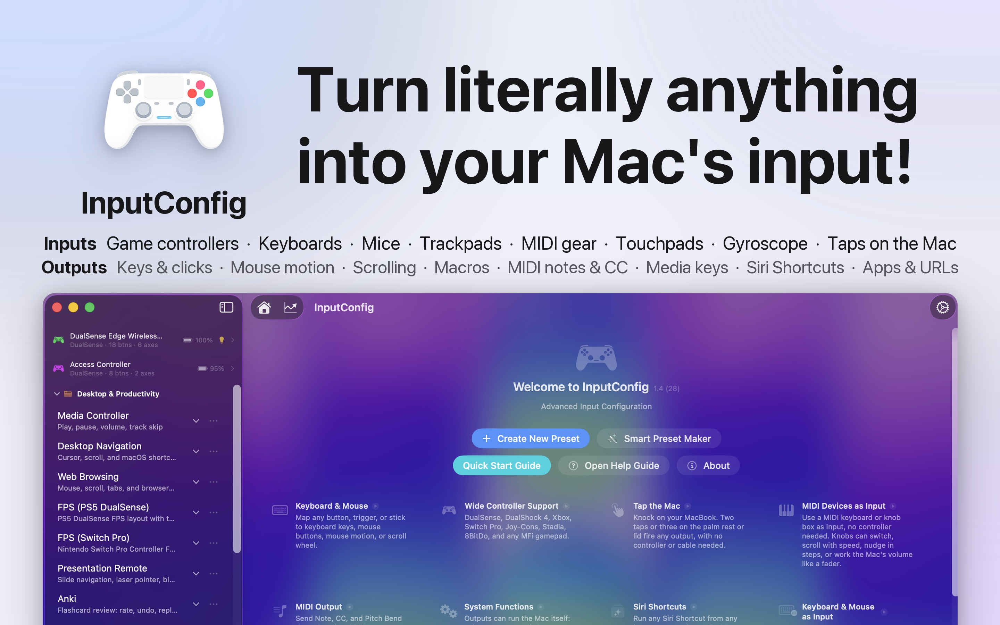
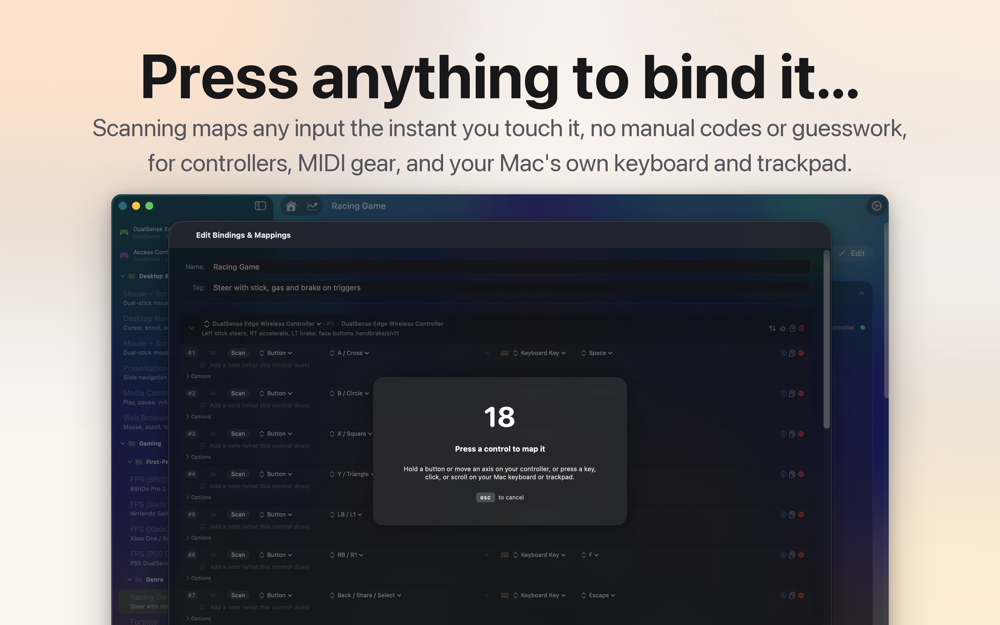
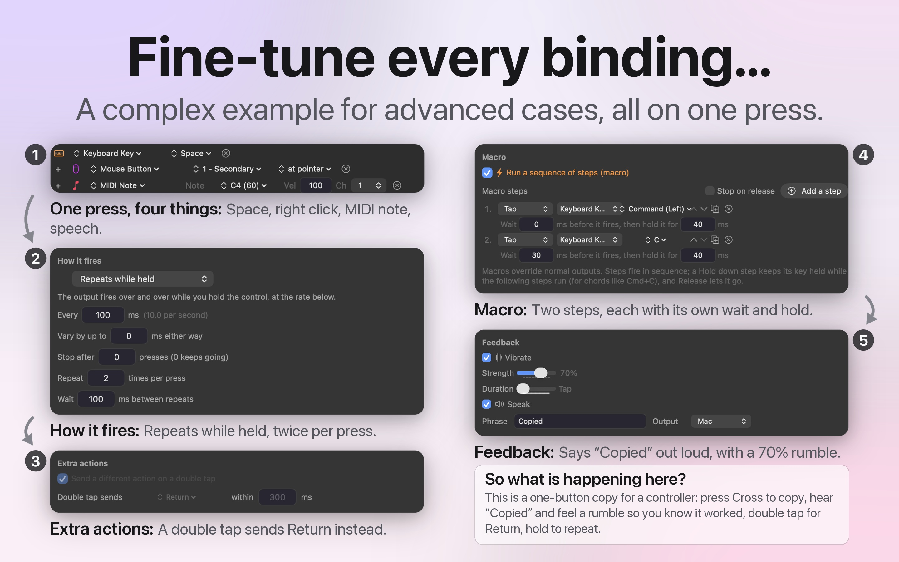
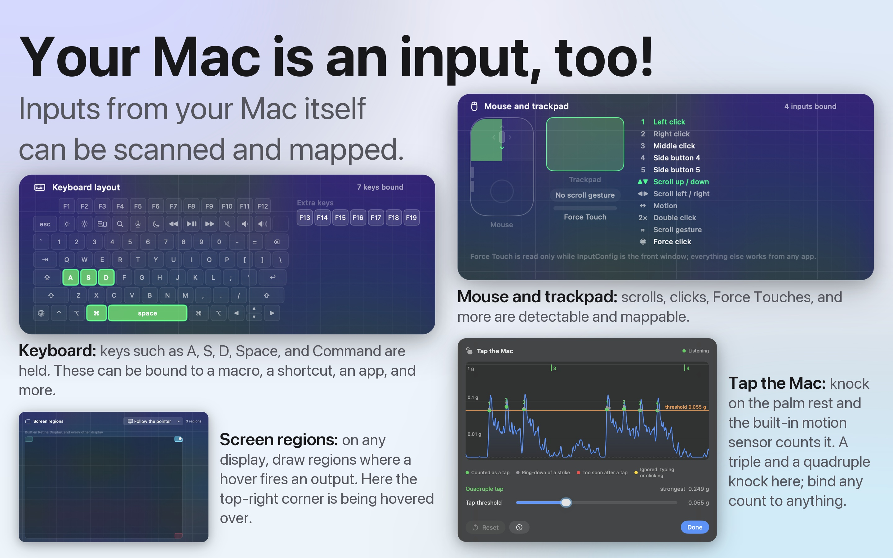
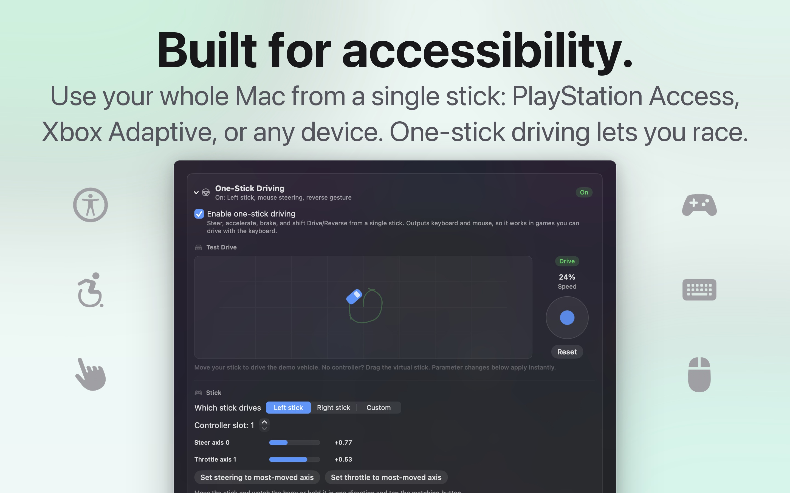
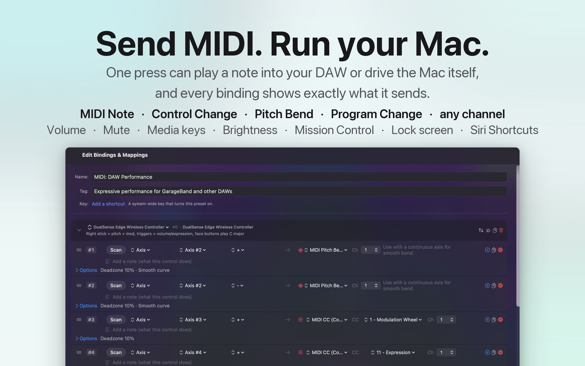
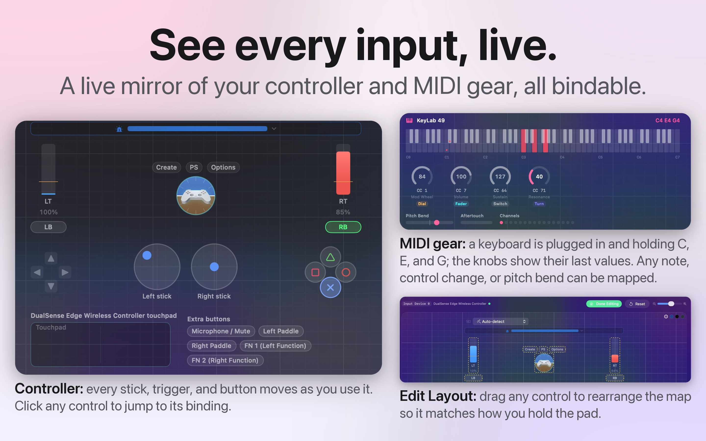
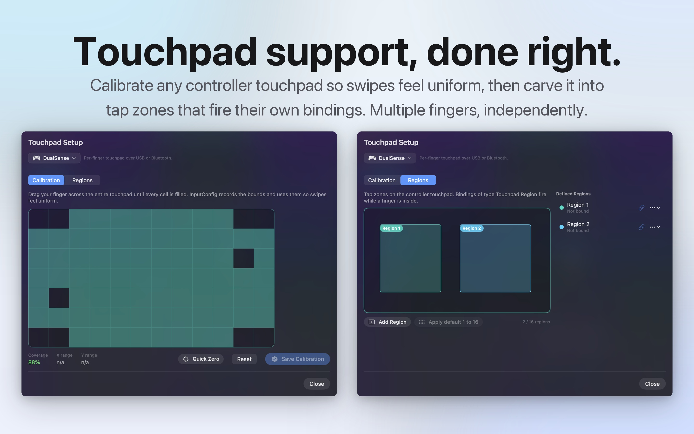
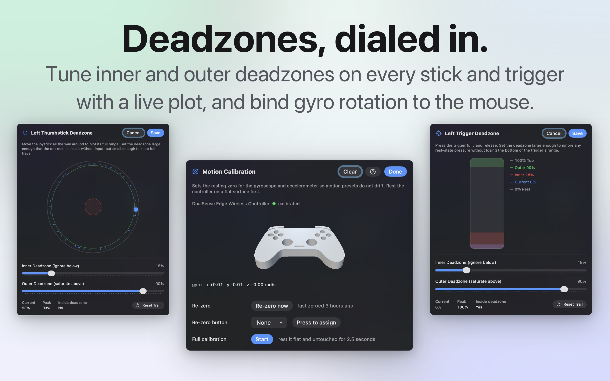
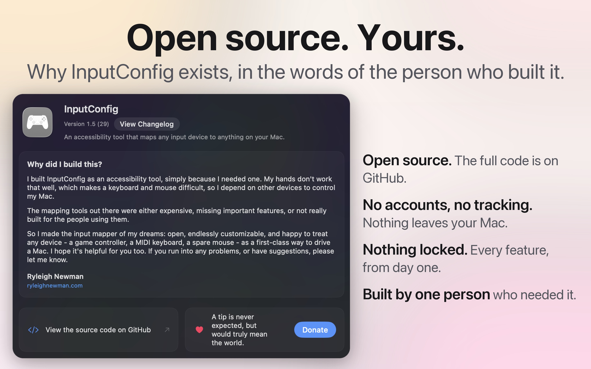

# InputConfig: free controller mapper for Mac

InputConfig is a free, open-source controller mapper for macOS. Map any PS5, Xbox or
Switch controller to keyboard keys and mouse movement, use a controller as a mouse,
run your Mac from a MIDI knob box, play games that never supported controllers, or
replace a keyboard entirely if using one is difficult. It works in every app, not
only games.

Works with PS5 DualSense and DualSense Edge, PS4 DualShock 4, Xbox Wireless, Series
and Elite, Switch Pro and Joy-Con, 8BitDo, the PlayStation Access Controller, the
Xbox Adaptive Controller, MIDI keyboards and pad controllers, and any HID-compatible
gamepad. No drivers, no subscription, no account.

Website and documentation: [inputconfig.com](https://inputconfig.com), with
[help for every feature](https://inputconfig.com/help/), [guides](https://inputconfig.com/guides/),
and [ready-made presets for 450+ games and apps](https://inputconfig.com/presets/).

## Overview

Plug in your device, pick a preset, and go. Or build your own from scratch: every
button, trigger, stick, key, knob, and pad can send keys, clicks, mouse motion,
scroll, macros, MIDI, spoken phrases, or a system function like volume, brightness,
or a Siri Shortcut.

It is not just for game controllers. Your Mac keyboard, a second keyboard, extra
mouse buttons, the trackpad (including Force Touch pressure), regions of the screen,
and full MIDI gear all work as inputs too.

## What's new in 1.5

- Tap the Mac now works on M1 Pro, M1 Max, and M1 Ultra MacBook Pros as well as M2 and later, counts up to five taps, and has a live calibration plot in the Options of any tap row
- Your Mac is an input: every key, including modifiers and media keys, plus clicks, scroll gestures, and Force Touch on the trackpad or mouse can be mapped, with live Keyboard and Mouse & Trackpad templates in the Live Visualizer
- Screen regions are their own input: draw an area of any display and it fires while the pointer is inside it, with a Screen template that shows the display, its regions, and the live pointer
- The Live Visualizer builds its map from the connected controller, with proper PlayStation button shapes, zoom, a choice of background, and every control clickable
- The editor has a search field, section headings, Automatically insert available inputs, and a device menu listing every controller, Bluetooth and USB device, this Mac's keyboard and mouse, and MIDI source
- Chords can hold up to three controls, and accessories plugged into a PlayStation Access Controller or Xbox Adaptive Controller are picked up as inputs
- Gyro pointing follows the controller's tilt like a laser pointer, Motion Calibration is one simple sheet with a 3D controller model, and pointer motion runs smoothly on a timer of its own
- Rumble on a DualSense Edge is much stronger, its strength setting works, and vibration has a Duration slider
- New presets: One-Stick Driving, Access Controller, Keyboard Deck, Trackpad & Mouse, Modifier Holds, Double Click Deck, Cursor Regions, Hold & Double-Tap, Keyboard & Mouse Input, Shortcuts & Apps, and Touchpad Zones
- The sidebar splits into My Presets and Built-in Presets, every Feature Showcase opens its preset, Help is rewritten, and the activity log shows everything the app does
- Fixes: a crash on first launch, the pointer walking off target with two displays, lone modifier keys invisible to apps, mouse buttons 3 and up hanging the app, and touchpad zones lost between presets

Full release history in [CHANGELOG.md](CHANGELOG.md). This section tracks the latest release.

## A tour

Open InputConfig and everything it can do is on one screen. Controllers, keyboards,
mice, trackpads, and MIDI gear go in; keys, mouse, macros, MIDI, system functions,
and Siri Shortcuts come out. Forty-two presets ship with it, sorted into folders you
can name and colour, and the Smart Preset Maker draws on a library of more than 450
games and apps.

Scanning maps any input the instant you touch it. No manual codes, no guesswork,
and it works for controllers, MIDI gear, and your Mac's own keyboard and trackpad.

One press can send a key, a click, a MIDI note, and a spoken phrase at once, then
repeat while held, send Return on a double tap, run a two-step macro, and rumble,
with every timing set right in the row.

Every key on the keyboard, every click, scroll gesture, and Force Touch on the
trackpad or mouse, any area of the screen, and a knock on the palm rest can all be
scanned and mapped like a controller button.

Drive your whole Mac from a single stick. One-stick driving steers, accelerates,
brakes, and shifts from one control, and it outputs keyboard and mouse, so it works
in games that never planned for it. Built with the PlayStation Access Controller
and other adaptive hardware in mind.

Play notes into your DAW through a virtual MIDI port, or let a MIDI keyboard or knob
box drive the Mac itself: volume, tracks, brightness, Mission Control, a Siri
Shortcut. Every binding shows exactly what it sends.

The Live Visualizer mirrors your controller and your MIDI gear in real time. Sticks,
triggers, keys, and knobs light up as you play, clicking any control jumps straight
to its binding, and Edit Layout rearranges the map to match how you hold the pad.

Calibrate a controller touchpad so swipes feel uniform, then carve it into tap zones
that fire their own bindings, with two fingers tracked independently.

Tune the inner and outer deadzone on every stick and trigger with a live plot, so
drift disappears and full travel stays. Bind gyroscope rotation to the mouse for
motion aim in any app, with live sensor readings and a resting-zero calibration.

No accounts, no tracking, no locked features. Built by one person who needed it.

## How it compares

| | InputConfig | Joystick Mapper | Gamepad Companion | Enjoyable | Karabiner-Elements |
|---|---|---|---|---|---|
| Cost | Free | Paid | Paid | Free | Free |
| Open source | Yes, MIT | No | No | Yes | Yes |
| Game controllers | Yes | Yes | Yes | Yes | No, keyboards only |
| MIDI keyboards and pads as input | Yes | No | No | No | No |
| Mac keyboard/mouse/trackpad as input | Yes | No | No | No | Keyboard only |
| DualSense Edge paddles and extras | Yes | No | No | No | No |
| System functions and Siri Shortcuts | Yes | No | No | No | Limited |
| Per-app preset switching | Yes | No | No | No | Yes |
| Macros, turbo, tap and hold | Yes | Limited | Limited | No | Limited |
| MIDI output | Yes | No | No | No | No |
| Gyroscope and motion | Yes | No | No | No | No |
| Light bar control | Yes | No | No | No | No |
| Still updated | Yes | Rarely | Rarely | No | Yes |

Checked August 2026. Some of these have been around far longer than mine and are good
tools. Check for yourself before you switch.

## Everything it does

### Input sources

- Every button, trigger, joystick, and D-pad on any MFi or HID-compatible gamepad
- DualSense Edge extras: both back paddles, both FN buttons, and the mute button, over USB and Bluetooth
- Controller touchpads: cursor control, two-finger tracking, tap zones, one-finger and two-finger taps, with per-pad calibration
- Gyroscope, accelerometer, and absolute attitude on Sony controllers (DualSense, DualShock 4)
- MIDI notes and pads, CC knobs, sliders, and pedals, the pitch wheel, channel aftertouch, and Program Change, from any MIDI device over USB or Bluetooth
- Three knob modes for MIDI dials: Switch (fires past halfway), Dial (speed grows from centre, like a stick), and Turn (a nudge per step of rotation, built for endless encoders)
- Per-binding MIDI channel and device filters, so two keyboards stay independent
- Your Mac keyboard as an input: every key, including Shift, Control, Option, Command, Caps Lock, fn, and the brightness, media, and volume keys, plus a second keyboard, captured per device
- Your mouse and trackpad as inputs: every button, double click, scroll in four directions, scroll gestures, Force Touch pressure, and Force Click
- Tap the Mac: knock on the palm rest and the MacBook's motion sensor fires any output, single to quintuple taps, with a live calibration plot
- Screen regions: areas of any display that act as inputs while the pointer is inside them, per display or on every display
- Bluetooth headset and hearing aid buttons as media keys
- Switches, pedals, and sticks plugged into a PlayStation Access Controller or Xbox Adaptive Controller
- Stick regions: directional zones on any stick with their own bindings

### Outputs

- Keyboard keys, including full modifier combos (Cmd+Shift+3 and friends fire as real chords)
- Type whole words or phrases from a single press
- Mouse buttons, analog mouse motion, smooth scrolling, and single scroll steps
- Macro sequences with custom timing, chord steps that hold one key while tapping others, and interrupt-on-release
- MIDI out to your DAW through a virtual port: notes with velocity, CC, pitch bend, Program Change, and transport (start, stop, continue)
- Spoken phrases, in the system voice or any installed voice
- Haptic feedback with adjustable strength and duration
- App actions: switch presets, jump to a specific preset, pause and resume output, all from the controller

### System functions

- Volume up, volume down, and mute, in the same steps as the keyboard keys
- System volume as a fader: the Mac's level follows a knob's position 1-to-1, and only takes over once you actually move it
- Play/pause, next track, and previous track, as real media keys
- Screen brightness up and down
- Mission Control, Launchpad, Spotlight, lock screen, and the screenshot toolbar
- Run any Siri Shortcut by name, picked from a list of your installed Shortcuts, without stealing focus
- Open any app or any URL, from https links to app schemes

### Per-binding control

- Toggle mode: press once to latch, press again to release
- Turbo with an adjustable rate, and repeat counts with custom delays
- Hold actions and double-tap actions, each with their own outputs and timing windows
- Chords: a row can require up to three controls held together, each chosen from the menu or scanned
- Inner and outer deadzones with a live visual calibrator on every stick and trigger
- Axis inversion and three sensitivity curves: linear, smooth, aggressive
- Variable sensitivity: trigger pressure and stick depth scale the output speed
- Stacked outputs: one input firing several outputs in parallel
- A note field on every binding, so a preset explains itself

### Presets

- 42 built-in presets: the Access Controller and One-Stick Driving, the Mac's own keyboard, trackpad, and modifiers, desktop navigation, web browsing, media control, popular games, MIDI and creative work, and feature showcases, every row annotated
- Smart Preset Maker builds a tailored preset from a few questions, from a library of more than 450 games, apps, and workflows, and can add a touchpad-as-trackpad, gyro fine aim, and trigger rumble
- Folders with names and colours, and unlimited presets of your own
- Per-app auto-switch: presets activate themselves when their app comes to the front
- Per-preset automation: launch an app or URL on activate, confine the cursor, auto-recenter, hide the pointer
- Import, export, and share presets, and convert them between controller types
- A global keyboard shortcut to toggle the most recent preset from anywhere
- Crash recovery restores your active preset, engine and all

### Live Visualizer

- A real-time mirror of every connected device, one panel per slot
- Switchable layouts per slot: controller, keyboard, mouse and trackpad, controller touchpad, screen regions, or MIDI instrument, with auto-detection from the bindings
- The MIDI instrument: a seven-octave velocity-shaded keyboard, a named dial for every knob (Mod Wheel, Cutoff, Sustain and the rest), knob-mode badges, pitch bend and aftertouch meters, a 16-channel activity strip, and a rolling event log
- Click any control to jump straight to its binding in the editor
- Edit Layout to drag controls into the arrangement you hold the pad in, saved per controller model, plus zoom, pan, and four backgrounds

### Accessibility

- One-stick driving: steer, accelerate, brake, and shift from a single stick
- App-wide text size, bold text, reduced transparency, and reduced motion, layered on top of the system settings
- VoiceOver support throughout, including the Live Visualizer spoken in plain words
- Built-in presets for the PlayStation Access Controller: Access Controller runs the whole desktop from one stick and eight sockets, and One-Stick Driving drives a whole car from one stick
- Deadzone and sensitivity tuning that matters for tremor and limited range of motion

### The app

- Light bar colors per preset with a full RGB picker, brightness control, and an RGB cycle, over USB and Bluetooth
- Battery level and connection state for every controller
- A changelog inside the app and a What's New popup after updates
- 42 built-in help guides, the same pages as inputconfig.com, and a guided Quick Start tour
- Menu bar control with a choice of twelve icons, plus Dock-only and menu-bar-only modes
- An activity log of everything the app does, with a one-file report ready to send
- Adjustable polling rate: 60, 120, 180, or 240 Hz, with an automatic battery saver
- Sandboxed, no network access, no telemetry

100% free.

## Supported controllers

- PlayStation Access Controller (and other adaptive hardware)
- PlayStation DualSense (PS5) and DualSense Edge, including the Edge's paddles and extra buttons
- PlayStation DualShock 4 (PS4) and DualShock 3
- Xbox Wireless Controller (One, Series X|S)
- Nintendo Switch Pro Controller and Joy-Cons
- 8BitDo controllers (Pro 2, Ultimate, SN30 Pro+, and more)
- Steam Controller, Stadia Controller, Logitech F-series, fight sticks, and wheels
- Any MFi or HID-compatible gamepad
- MIDI keyboards, pad controllers, knob boxes, and control surfaces
- Your Mac keyboard, mouse, and trackpad

## Questions people ask

**How do I use a PS5 or Xbox controller as a keyboard and mouse on Mac?**
Install InputConfig, plug in or pair the controller, pick a preset, and press Activate.
macOS will ask for Accessibility permission the first time, which is what lets any app send
keystrokes and mouse movement.

**Can I use a MIDI keyboard or pad controller to control my Mac?**
Yes, and it needs no game controller alongside it. Notes and pads act like buttons,
knobs get three modes (Switch, Dial, Turn), the sustain pedal is a switch, and a knob
bound to System Volume becomes a hardware volume fader. The built-in MIDI: Knob Deck
and MIDI: Media Deck presets are ready to remap.

**Can I map the DualSense Edge back paddles and FN buttons?**
Yes. The Edge's back paddles, both FN buttons, and the mute button are bindable like
any other input, over both USB and Bluetooth.

**Can a button run a Siri Shortcut or change the volume?**
Yes. System Functions are outputs like any other: volume, mute, media keys,
brightness, Mission Control, lock screen, the screenshot toolbar, any Siri Shortcut
by name, or opening any app or URL.

**Is there a free alternative to Joystick Mapper or Gamepad Companion?**
This is one. InputConfig is free with nothing locked, and the source is public under MIT.

**Can I use a controller instead of a keyboard and mouse entirely?**
Yes, that is the point. There are built-in presets for desktop navigation, web browsing,
and media control, plus presets built for adaptive controllers. You can map screen regions,
type whole phrases from one button, and switch presets automatically per app.

**Does it work with the PlayStation Access Controller or the Xbox Adaptive Controller?**
Yes, along with anything else that presents as an MFi or HID gamepad, and the switches,
pedals, and sticks plugged into their ports are inputs too. The Access Controller preset
runs the whole desktop from one stick and eight sockets, and One-Stick Driving lets a
single stick handle steering, throttle, braking, and gear changes. Accessibility is why the app exists, not an
afterthought.

**Do I need drivers?**
No. Connect the controller by USB or Bluetooth and macOS handles the rest. MIDI
devices are found automatically too.

**Can I map a controller for a game that has no controller support?**
Yes. Map the buttons and sticks to whatever keys and mouse motion the game expects, and it
sees a normal keyboard and mouse.

**Is it really free?**
Yes. No paid tier, no trial, no locked features. There is a tip jar in the app that unlocks
nothing.

## Requirements

- macOS 14.0 or later
- Accessibility permission (for keyboard and mouse simulation)
- Tap the Mac needs a MacBook with M2 or later, or an M1 Pro, M1 Max, or M1 Ultra

## Building

1. Open `InputConfig.xcodeproj` in Xcode 26 or later
2. Select your team in Signing & Capabilities
3. Build and run

## License

MIT License. See [LICENSE](LICENSE) for details.

## Privacy

InputConfig does not collect any data. See [PRIVACY.md](PRIVACY.md).

## Contact

Questions, bugs, or feature requests? Open an issue here, see [inputconfig.com/help](https://inputconfig.com/help/), or reach out at [ryleighnewman.com](https://ryleighnewman.com).
